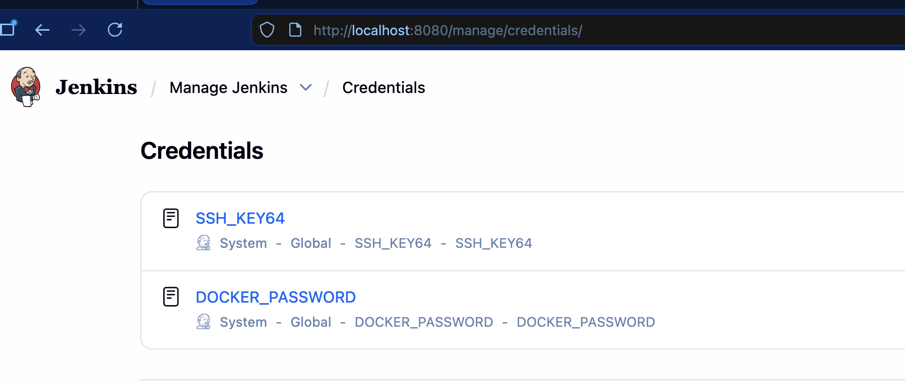
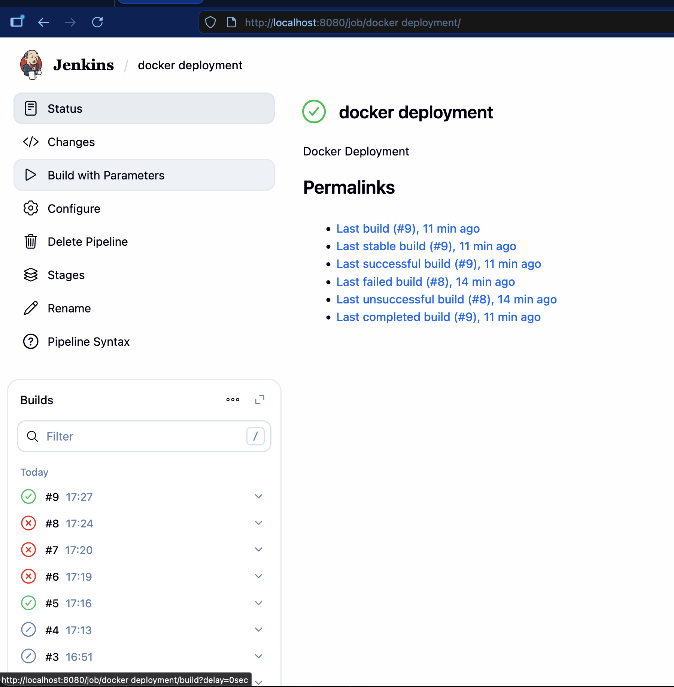
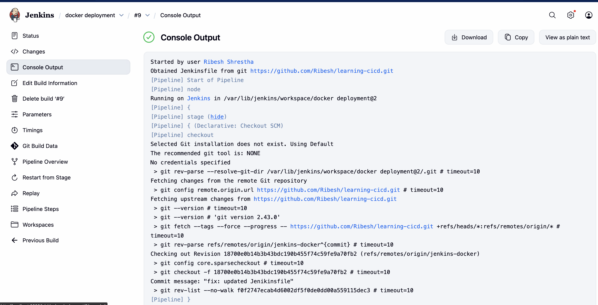
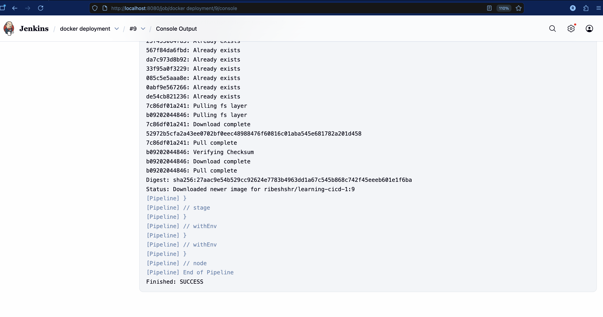
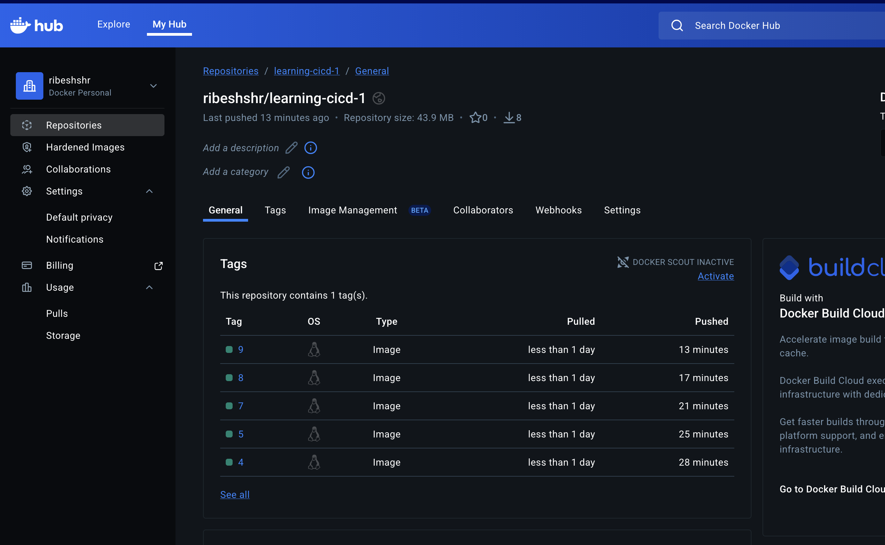
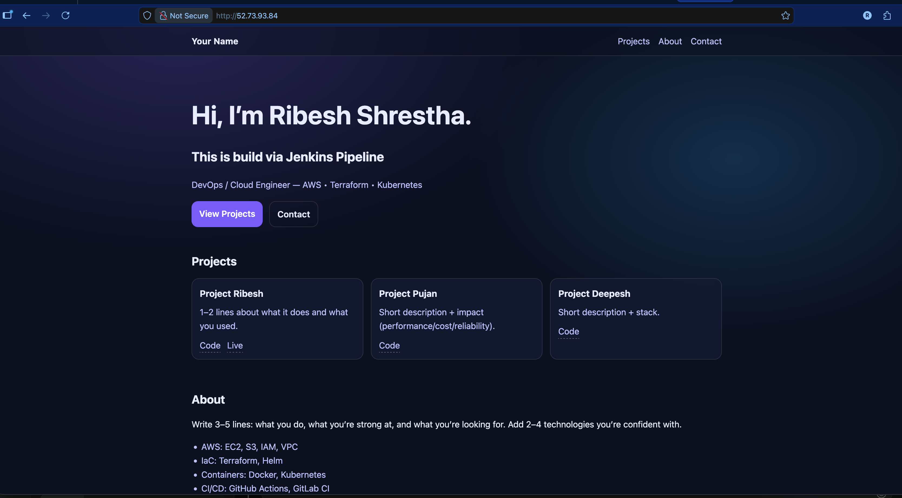

# Write a CI/CD in Jenkins which should build a docker image and deploy that in EC2


## Workflow:
1. User pushes latest changes of code to Github
2. We can trigger **Jenkins Pipeline** manually on `jenkins-docker` branch
    -   **Jenkins** runs on `Ubuntu Machine` (not inside docker)
    -   The **Jenkins** Host should have `docker` installed as well + docker's plugin
    -   Configures SSH and SSH Key Access on the Jenkins agent
    -   Builds **docker image** and pushes to container registry (DockerHub) with build number as image tag
    -   In the EC2 intance, it stops and removes the running container and run the latest image
3. Changes are reflected on port `80`
 
## Configuration Steps:
1. Firstly create a `Dockerfile`
    ```bash
    FROM nginx:1.29-alpine

    RUN rm -rf /usr/share/nginx/html/*

    COPY index.html styles.css /usr/share/nginx/html/

    EXPOSE 80
    ```

2. Create `Jenkinsfile` file

    ```yaml
    pipeline {
        agent any
        
        parameters {
            string(
                name: 'SERVER_IP',
                defaultValue: '52.73.93.84',
                description: 'Enter server IP address'
            )
        }
        
        environment {
            SERVER_IP   =   "${params.SERVER_IP}"
            DOCKER_USERNAME = "ribeshshr"
            IMAGE_TAG   =   "${BUILD_NUMBER}"

        }
        
        stages {
            stage('Configure SSH') {
                steps {
                    sh '''
                    mkdir -p ~/.ssh
                    chmod 700 ~/.ssh
                    cat > ~/.ssh/config <<'EOF'
    Host *
    StrictHostKeyChecking no
    EOF
                    cat ~/.ssh/config   #to verify
                    touch ~/.ssh/known_hosts
                    chmod 600 ~/.ssh/known_hosts
                    '''
                }
            }
            stage('Populate SSH Key') {
                steps {
                    withCredentials([string(credentialsId: 'SSH_KEY64', variable: 'SSH_KEY64')]) {
                        sh '''
                        echo "$SSH_KEY64" | base64 -d > mykey.pem
                        chmod 600 mykey.pem
                        ssh-keygen -R ${SERVER_IP}
                        '''
                    }
                }
            }

            stage('Build & Push Docker Image'){
                steps{
                    withCredentials([string(credentialsId: 'DOCKER_PASSWORD', variable: 'DOCKER_PASSWORD')]) {
                        sh '''
                            docker buildx build --platform linux/amd64 -t ${DOCKER_USERNAME}/learning-cicd-1:${IMAGE_TAG} .
                            echo $DOCKER_PASSWORD | docker login --username ${DOCKER_USERNAME} --password-stdin
                            docker push ${DOCKER_USERNAME}/learning-cicd-1:${IMAGE_TAG}
                        '''
                    }
                }
            }

            stage('Deploy') {
                steps {
                    sh '''
                    ssh ec2-user@${SERVER_IP} -i mykey.pem -T \
                        "docker stop learning-cicd || true && \
                        docker rm learning-cicd || true && \
                        docker run -d --name learninig-cicd -p 80:80 ${DOCKER_USERNAME}/learning-cicd-1:${IMAGE_TAG}"
                    '''
                }
            }
        }
    }
    ```


3.  Create `Secret Text` in Jenkins UI
    -   Secret Text:
        - DOCKER_PASSWORD
        - SSH_KEY64
    
    

4. Push the latest code the github

5. Manually run the Pipeline
    

## Screenshots




