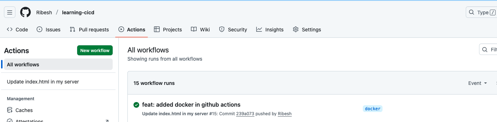
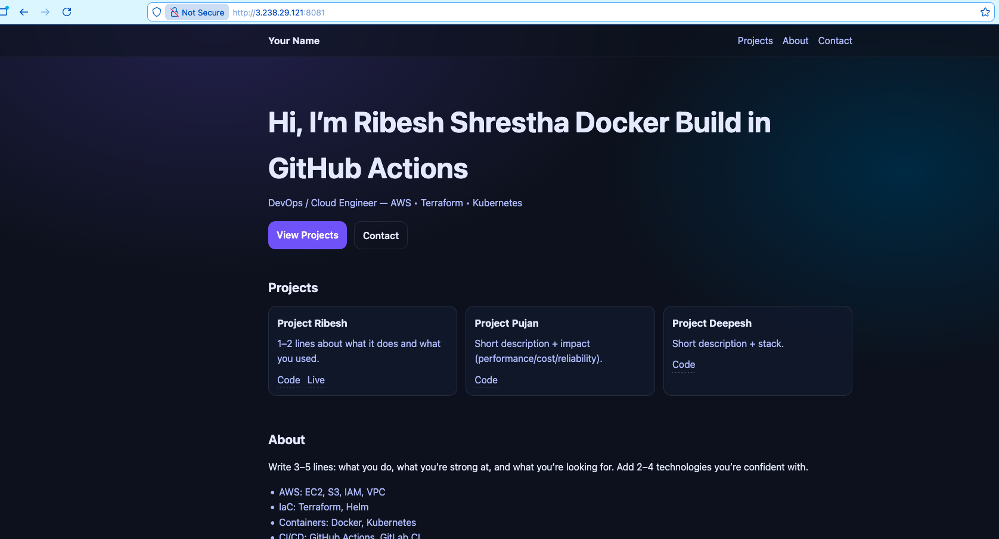

# Write a CI/CD in GitHub Actions that triggers when code is changed in your repo. It should build a docker image and deploy that in EC2.


## Workflow:
1. User pushes latest changes of code to Github
2. **Github Actions** is triggered on `main` and `docker` branch
    -   Github Action runs on `ubuntu-latest`
    -   Firstly, it clones the code via `actions/checkout@v5`
    -   Configures SSH and SSH Key Access on the runner
    -   Builds **docker image** and pushes to container registry (DockerHub) with build number as image tag
    -   In the EC2 intance, it stops and removes the running container and run the latest image
3. Changes are reflected on port `8081`
 
## Configuration Steps:
1. Firstly create a `Dockerfile`
    ```bash
    FROM nginx:1.29-alpine

    RUN rm -rf /usr/share/nginx/html/*

    COPY index.html styles.css /usr/share/nginx/html/

    EXPOSE 80
    ```

2. Create `.github/workflows/pipleline.yaml` file

    ```bash
    name: "Update index.html in my server"

    on: 
    push:
        branches:
        - main
        - docker


    jobs:
    deploy_my_code:
        name: "Deploy my code to my server"
        runs-on: ubuntu-latest
        env:
        SERVER_IP: ${{ vars.SERVER_IP }}
    

        steps:
        - uses: actions/checkout@v5
            with:
            fetch-depth:  0
            

        - name: "Configure SSH"
            run:  |
            mkdir -p ~/.ssh 
            chmod 700 ~/.ssh 
            echo -e "Host *\n\tStrictHostKeyChecking no\n\n" > ~/.ssh/config
            cat ~/.ssh/config
            touch ~/.ssh/known_hosts
            chmod 600 ~/.ssh/known_hosts


        - name: "SSH Key Access"
            run:  |
            touch mykey.pem
            echo $SSH_KEY64 | base64 -d > mykey.pem && chmod 400 mykey.pem
            ssh-keygen -R ${SERVER_IP}
            env:
            SSH_KEY64: ${{ secrets.SSH_KEY64 }}


        - name: "Build and push the image to Docker Registry"
            run:  |
            docker ps
            docker build -t "$DOCKER_USERNAME/learning-cicd:$GITHUB_RUN_NUMBER" .
            echo $DOCKER_PASSWORD | docker login --username $DOCKER_USERNAME --password-stdin
            docker push "$DOCKER_USERNAME/learning-cicd:$GITHUB_RUN_NUMBER"
            env:
            DOCKER_PASSWORD: ${{ secrets.DOCKER_PASSWORD }}
            DOCKER_USERNAME: ${{ vars.DOCKER_USERNAME }}


        - name: "Deploy the code to server"
            run:  |
            IMAGE="ribeshshr/learning-cicd:${GITHUB_RUN_NUMBER}"
            ssh -T ec2-user@${SERVER_IP} -i mykey.pem \
                "docker stop learning-cicd || true && \
                docker rm learning-cicd || true && \
                docker run -d --name learning-cicd -p 8081:80 ${IMAGE}"
    ```


3.  Create `Secrets` and `Variables` for GitHub Actions
    -   Secrets:
        - DOCKER_PASSWORD
        - SSH_KEY64
    
    -   Variables
        - DOCKER_USERNAME
        - SERVER_IP

4. Push the latest code the github

5. Pipeline should trigger

## Screenshots

GitHub Actions



